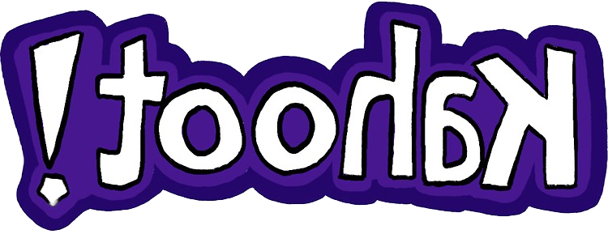

    
    <h1>Toohak</h1>
    
    
    
    
    

# Toohak

A Kahoot clone: [https://toohak-a8f56.web.app/](https://toohak-a8f56.web.app/)

# Homepage

# Create a Quiz

# Quiz Page

A dynamic and interactive online quiz platform, **Toohak** brings the excitement and competitiveness of classroom and office quizzes to the digital realm. Built using Firebase and Bootstrap, Toohak is designed as a clone of the popular quiz platform Kahoot, offering a similar engaging and user-friendly experience for both quiz creators and participants. Whether for educational purposes, team-building activities, or just for fun, Toohak enables users to create and join live quiz competitions with ease.

## Table of Contents

1. [Overview](#-overview)
2. [Features and Demo](#features-and-demo)
3. [Setting up the Development Environment](#%EF%B8%8F-setting-up-the-development-environment)
4. [License](#-license)

## 🌟 Overview

Toohak is a Firebase-powered quiz platform that mimics the functionality and lively atmosphere of Kahoot. It offers an interactive way to conduct quizzes, polls, and Q&A sessions, ideal for educators, corporate trainers, and event organizers seeking to engage their audience. Users can create customized quizzes with various question types, integrate multimedia elements, and monitor real-time participation and feedback.

## **Features and Demo**

### Feature 1: Custom Quiz Creation

- **Description**: Users can easily create quizzes with customized questions, answers, and time limits. Supports multimedia integration for a richer question presentation.

### Feature 2: Live Quiz Sessions

- **Description**: Conduct live quiz sessions where participants can join using a unique game code. The platform supports real-time scoring.

## 🛠️ Setting up the Development Environment

To set up your own instance of Toohak:

1. **Clone the Repository**:

   - Use the command `git clone https://github.com/gunshy/toohak` to clone the repository.

2. **Firebase Setup**:

   - Create a Firebase project through the Firebase console.
   - Integrate Firebase with your application for authentication, database, and hosting services.

3. **Install Dependencies**:

   - Navigate to the project directory and run `npm install` to install necessary dependencies.

4. **Local Development**:

   - Use `firebase serve` to run the application locally for development and testing purposes.

5. **Deployment**:
   - Deploy your application using `firebase deploy` to publish your quiz platform to the web.

## 📄 License

This project is licensed under the MIT License - see the LICENSE file for details.
